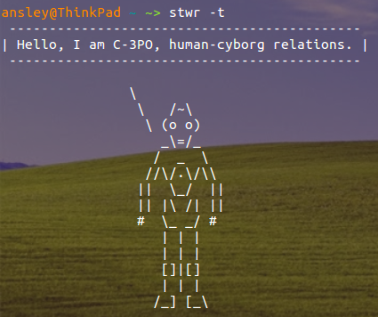

# stwr
Inspired by [cowsay](https://wikipedia.org/wiki/Cowsay) and the forthcoming
trilogy, stwr is a fun CLI generating ASCII pictures of Star Wars characters 
and a *famous* quote.

## Requirements
Python 3

## Installation
Clone this repo, then `cd stwr`

Change permissions of the executable with `chmod +x stwr`

Move the file to your `$PATH`, usually this is `/usr/bin/` or `usr/local/bin`

## Usage
Type `stwr` to see the full list of options

May the force be with you

